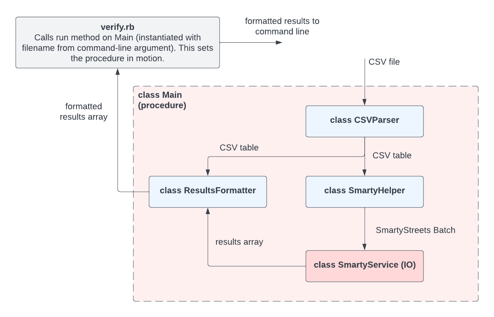

# Address Verification

## Setup 
- Install and use Ruby version 3.1.2
- Run `bundle`
- Set up Smarty API credentials for authentication

### Set up Smarty API authentication
- Locate your Secret Keys and add to `credentials.rb`
- Avoid committing this file by running:
```
git update-index --assume-unchanged credentials.rb
```
If you wish to reverse this action, run:
```
git update-index --no-assume-unchanged credentials.rb
```

## Run unit tests
```
bundle exec rspec ./spec/unit -fd
```

## Run functional tests (will use 3 address lookups per test run)
```
bundle exec rspec ./spec/functional -fd
```

## Verify a CSV file of addresses
- The CSV file should have the headings `Street, City, Zip Code`
- The file should be located in the `app/data` directory
- For a file named `addresses.csv`, run this command from the project root:
```
$ ruby verify.rb addresses.csv
```
This will output:
```
143 e Maine Street, Columbus, 43215 -> 143 E Main St, Columbus, 43215-5370
1 Empora St, Title, 11111 -> Invalid Address
```

## Project structure

The clean architecture principle was used as a basis for organizing this project. (See video below for details.)

The project was divided into processes with values at the boundaries. The api service call is made from a procedure that calls to the various processes which prepare data for the api and format the result. This allows decoupling of the IO. The processes can be easily unit tested and the IO can be exercised by a functional test.



The SmartyStreets Ruby SDK gem is used for making the api call. The SimpleCov gem is used for code coverage analysis.

## Clean Architecture video
<a href="https://youtu.be/DJtef410XaM"></a>
